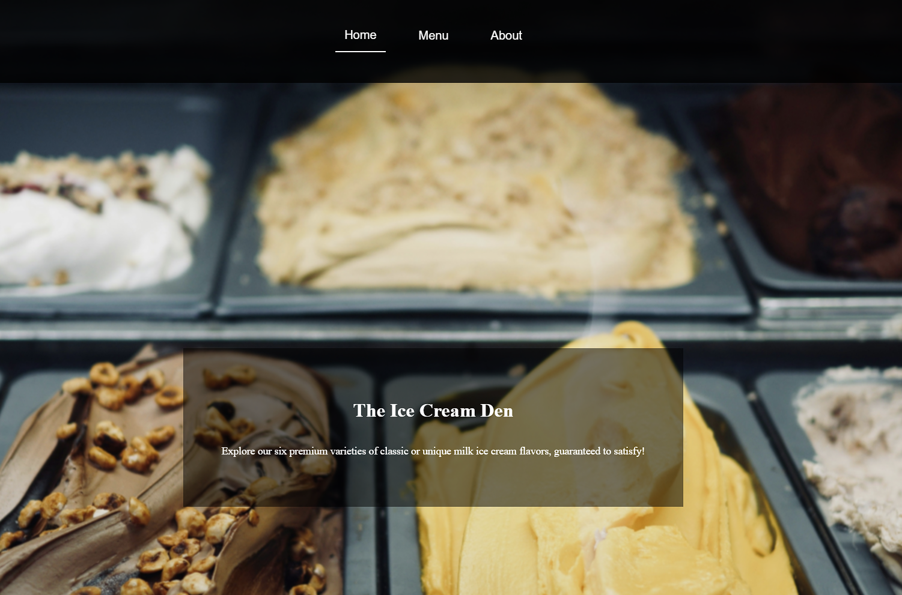

# Restaurant Page

Mock restaurant page featuring ice-cream

Built as part of [The Odin Project](https://www.theodinproject.com/) curriculum to practice **DOM Manipulation**, **tabular navigation** and **webpack**.

## Features

- Fully dynamic page content from Javascript
- Tabbed navigation for Home, Menu, and About sections
- Bundled via webpack

## Demo

### [Live Demo](https://songzhang015.github.io/project-10-restaurant-page/)

## Built Using

- HTML
- CSS
- Javascript

## Attribution and Credits for Ice Cream Photos Used
- Vanilla Image: [Image Link](https://commons.wikimedia.org/wiki/File:Scooping_passionfruit_ice_cream_(4566754508).jpg)
Joy, CC BY 2.0 <https://creativecommons.org/licenses/by/2.0>, via Wikimedia Commons

- Chocolate Image: [Image Link](https://commons.wikimedia.org/wiki/File:Ice_cream_cone_(cropped).jpg)
User:Managementboy, CC BY 1.0 <https://creativecommons.org/licenses/by/1.0>, via Wikimedia Commons

- Strawberry Image: [Image Link](https://commons.wikimedia.org/wiki/File:Strawberry_ice_cream_cone_(5076899310).jpg)
TheCulinaryGeek from Chicago, USA, CC BY 2.0 <https://creativecommons.org/licenses/by/2.0>, via Wikimedia Commons

- Cookies'n'Cream Image: [Image Link](https://commons.wikimedia.org/wiki/File:Udders_Cookies_and_Cream_Ice_Cream.jpg)
Carmenwongjw, CC BY-SA 4.0 <https://creativecommons.org/licenses/by-sa/4.0>, via Wikimedia Commons

- Mint Chocolate Chip Image: [Image Link](https://commons.wikimedia.org/wiki/File:2020-04-27_22_23_10_Friendly%27s_Mint_Chocolate_Chip_Ice_Cream_in_the_Franklin_Farm_section_of_Oak_Hill,_Fairfax_County,_Virginia.jpg)
Famartin, CC BY-SA 4.0 <https://creativecommons.org/licenses/by-sa/4.0>, via Wikimedia Commons

- Peanut Butter Caramel Image: [Image Link](https://commons.wikimedia.org/wiki/File:Dreyer%27s_Limited_Edition_Toll_House_Peanut_Butter_Cookie_Dough_Ice_Cream_4_(32298528554).jpg)
theimpulsivebuy, CC BY-SA 2.0 <https://creativecommons.org/licenses/by-sa/2.0>, via Wikimedia Commons
